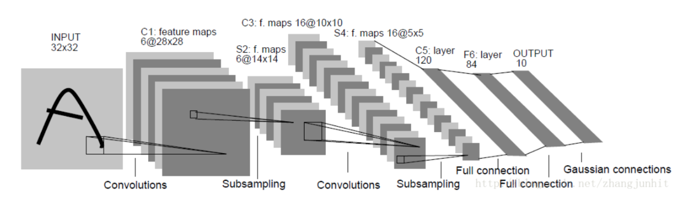

# LeNet5手写数字识别

## 实验要求

本次实验要求使用深度学习框架，只是用python来实现LeNet5，进而完成对于MNIST数据集中0-9这10类手写数字的识别任务。
基于上述实验要求，需要实现网络各层的前向计算和梯度的反向传播，并且选用合适的优化算法根据梯度更新参数。

## 网络结构



LeNet5的网络结构相对简单，主要有多层卷积层、下采样层和全连接层构成，其中卷积层和下采样层主要完成了对于图像特征的提取工作，全连接层则负责完成分类工作。
其网络结构各层的具体参数如下

1. 输入层

​	输入层输入的图片维度信息为 $1\times 32\times 32 $，也就是说输入的为一维的灰度图信息。

2. 卷积层C1

   |     参数     |        数值         |
   | :----------: | :-----------------: |
   |  输入通道数  |          1          |
   |  输出通道数  |          6          |
   |  卷积核大小  |     $5\times5$      |
   |     步长     |          1          |
   |   有无填充   |         无          |
   | 输出图像大小 | $6\times28\times28$ |

3. 池化层S2

   |     参数     |        数值         |
   | :----------: | :-----------------: |
   |  输入通道数  |          6          |
   |  输出通道数  |          6          |
   |  滤波器大小  |     $2\times2$      |
   |     步长     |          2          |
   | 输出图像大小 | $6\times14\times14$ |

4. 卷积层C3

   |     参数     |         数值         |
   | :----------: | :------------------: |
   |  输入通道数  |          6           |
   |  输出通道数  |          16          |
   |  卷积核大小  |      $5\times5$      |
   |     步长     |          1           |
   |   有无填充   |          无          |
   | 输出图像大小 | $16\times10\times10$ |

5. 池化层S4

   |     参数     |        数值        |
   | :----------: | :----------------: |
   |  输入通道数  |         16         |
   |  输出通道数  |         16         |
   |  滤波器大小  |     $2\times2$     |
   |     步长     |         2          |
   | 输出图像大小 | $16\times5\times5$ |

6. 全连接层F5

   |   参数   | 数值 |
   | :------: | :--: |
   | 输入维度 | 400  |
   | 输出维度 | 120  |

7. 全连接层F6

   |   参数   | 数值 |
   | :------: | :--: |
   | 输入维度 | 120  |
   | 输出维度 |  84  |

8. 输出层

   |   参数   | 数值 |
   | :------: | :--: |
   | 输入维度 |  84  |
   | 输出维度 |  10  |

9. 损失函数

   在本次实验中，采用交叉熵损失函数

10. 其他

    在每一次通过池化层之后，都会经过一个激活层，在本次实验中选用ReLu作为激活函数

在本次网络的结构实现过程中，与LeCun在论文中提出的结构稍有不同，主要在一下几个细节处

* 在原文中激活函数采用的是Sigmod函数，但是考虑到Sigmod函数在进行反向传播的时候，如果输入值不接近0，则很容易出现梯度消失的问题，因此在本次实验中选用了ReLu作为激活函数，一方面能够较好解决反向传播过程中梯度消失的问题，另一方面也简化了代码实现难度。
* 原文中的池化层采用了一种类似于平均池化的方式，即通过滤波器求平均值然后加上一个可训练的偏置项，然后再通过Sigmod激活层。在本次实验中为了简化实现难度，采用了最大池化的方式，同样能够提取出所需要的局部特征信息。
* 原文中对于C3卷积层并没有与上一层的全部通道进行连接，而是采取了一种类似于dropout的方式与部分通道进行连接，可以有效避免过拟合现象。在实现的过程中仍然采用了全部连接的方式，并没有出现过拟合现象。

## 代码细节

### `Layer`

首先定义了一个表示网络层结构的抽象基类`Layer`，其中提供了`forward`和`backward`方法接口，用以提供前向推理和梯度反向传播。

#### `ReLu`

在本次实验中的激活函数选用了ReLu，主要为了避免在反向传播过程中导致梯度消失的问题。其前向计算如下
$$
ReLu(x) = 
\begin{cases}
x , x\geq0\\
0, x < 0
\end{cases}
$$
而对于梯度的反向传播，其计算如下
$$
grad(x)=
\begin{cases}
1\times grad_{back},x\geq0\\
0,x<0
\end{cases}
$$
代码实现如下

```python
def forward(self, X):
    self.input = X.copy()
    self.output = np.maximum(0, X)
    return self.output

def backward(self, back_grad):
    grad = self.input > 0
    return back_grad * grad
```

#### `MaxPool`

在本次实验中，池化层采用了最大池化的方式，即通过滤波器筛选出最大的元素作为池化结果。其前向计算如下
$$
MaxPool(x[i:i+size,j:j+size]) = max\{x[i:i+size,j:j+size]\}
$$
对于其梯度的反向传播，只有被选择为最大值的元素位置对应会被梯度反向传播，其余的位置都赋值为0，其基本计算如下
$$
grad(x[i:i+size,j:j+size]) = 
\begin{cases}
grad_{back}[i,j], x[m,n]=max\\
0,else
\end{cases}
$$
具体代码实现如下

```python
def forward(self, X):
    h_size = self.pool_size[0]
    w_size = self.pool_size[1]
    N, C, H, W = X.shape
    output_H = H // h_size
    output_W = W // w_size
    self.input = X.copy()
    self.output = np.zeros((N, C, output_H, output_W))
    for h in range(output_H):
        for w in range(output_W):
            self.output[:, :, h, w] = np.max(X[:, :, h*h_size:(h+1)*h_size, w*w_size:(w+1)*w_size], axis=(2, 3))
    return self.output

def backward(self, back_grad):
    h_size = self.pool_size[0]
    w_size = self.pool_size[1]
    N, C, H, W = self.input.shape
    output_H = H // h_size
    output_W = W // w_size
    grad = np.zeros_like(self.input)
    for h in range(output_H):
        for w in range(output_W):
            tmp_x = self.input[:, :, h*h_size:(h+1)*h_size, w*w_size:(w+1)*w_size].reshape((N, C, -1))
            mask = np.zeros((N, C, h_size*w_size))
            mask[np.arange(N)[:, None], np.arange(C)[None, :], np.argmax(tmp_x, axis=2)] = 1
            grad[:, :, h*h_size:(h+1)*h_size, w*w_size:(w+1)*w_size] = mask.reshape((N, C, h_size, w_size)) * back_grad[:, :, h, w][:, :, None, None]
    return grad
```

`forward`前向传播的过程比较简单，直接对于滤波器选取的元素取最大值即可。而对于`backward`梯度反向传播的过程，则相对比较复杂。因为梯度只会反向传播到最大值对应的元素位置处，所以需要首先计算出最大值位置的mask掩码，然后将传入的梯度和对应的mask进行对位乘法。

#### `Linear`

全连接层的实现和之前MLP的实现是完全一致的，此时需要注意的事，由于全连接层是包含参数的，因此除了需要计算反向传播的梯度之外，还需要计算各个参数对应的梯度。

全连接层具有参数$\mathbf{W}$和$\mathbf{b}$，其前向传播的计算如下
$$
\mathbf{Y} = \mathbf{x}\times\mathbf{W}+\mathbf{b}
$$
梯度反向传播的计算如下
$$
grad=grad_{back}\times\mathbf{W}^T\\
grad_{\mathbf{W}} = \mathbf{x}^T\times grad_{back}\\
grad_{\mathbf{b}} = sum(grad_{back})
$$
代码具体实现如下

```python
def forward(self, X):
    self.input = X.copy()
    self.output = np.dot(X, self.W['value']) + self.b['value']
    return self.output

def backward(self, back_grad):
    grad = np.dot(back_grad, self.W['value'].T)
    self.W['grad'] = np.dot(self.input.T, back_grad)
    self.b['grad'] = np.sum(back_grad, axis=0)
    return grad
```

#### `Conv`

卷积层主要符号表示如下

|   符号    |    含义    |
| :-------: | :--------: |
| $C_{in}$  | 输入通道数 |
| $C_{out}$ | 输出通道数 |
|    $S$    | 卷积核大小 |
|    $N$    | batch_size |

其前向传播的运算如下
$$
\mathbf{Y} = \mathbf{x} \otimes\mathbf{W}+\mathbf{b}
$$
其反向传播的计算如下
$$
grad=\mathbf{x}\otimes\mathbf{W}_{rot180}\\
grad_{\mathbf{W}}=\mathbf{x}\otimes grad_{back}\\
gard_{\mathbf{b}} = \sum grad_{back}
$$
具体代码实现如下

```python
def forward(self, X):
    self.input = X.copy()
    N, C, H, W = X.shape
    padding_x = np.pad(X, ((0, 0), (0, 0), (self.padding, self.padding), (self.padding, self.padding)))
    output_H = (H + 2 * self.padding - self.filter_size) // self.stride + 1
    output_W = (W + 2 * self.padding - self.filter_size) // self.stride + 1
    self.output = np.zeros((N, self.out_channels, output_H, output_W))
    for h in range(output_H):
        for w in range(output_W):
            tmp_x = padding_x[:, :, h * self.stride:h * self.stride + self.filter_size, w * self.stride:w * self.stride + self.filter_size].reshape((N, 1, self.in_channels, self.filter_size, self.filter_size))
            tmp_W = self.W['value'].reshape((1, self.out_channels, self.in_channels, self.filter_size, self.filter_size))
            self.output[:, :, h, w] = np.sum(tmp_x * tmp_W, axis=(2, 3, 4)) + self.b['value']
    return self.output

def backward(self, back_grad):
    N, C, H, W = self.input.shape
    padding_x = np.pad(self.input, ((0, 0), (0, 0), (self.padding, self.padding), (self.padding, self.padding)))
    output_H = (H + 2 * self.padding - self.filter_size) // self.stride + 1
    output_W = (W + 2 * self.padding - self.filter_size) // self.stride + 1
    self.W['grad'] = np.zeros((self.out_channels, self.in_channels, self.filter_size, self.filter_size))
    self.b['grad'] = np.zeros(self.out_channels)
    grad = np.zeros_like(padding_x)
    for h in range(output_H):
        for w in range(output_W):
            tmp_back_grad = back_grad[:, :, h, w].reshape((N, 1, 1, 1, self.out_channels))
            tmp_W = self.W['value'].transpose((1, 2, 3, 0)).reshape((1, self.in_channels, self.filter_size, self.filter_size, self.out_channels))
            grad[:, :, h * self.stride:h * self.stride + self.filter_size, w * self.stride:w * self.stride + self.filter_size] += np.sum(tmp_back_grad * tmp_W, axis=4)
            tmp_back_grad = back_grad[:, :, h, w].T.reshape((self.out_channels, 1, 1, 1, N))
            tmp_x = padding_x[:, :, h * self.stride:h * self.stride + self.filter_size, w * self.stride:w * self.stride + self.filter_size].transpose((1, 2, 3, 0))
            self.W['grad'] += np.sum(tmp_back_grad * tmp_x, axis=4)
            self.b['grad'] += np.sum(back_grad[:, :, h, w], axis=0)
    grad = grad[:, :, self.padding:self.padding + H, self.padding:self.padding + W]
    return grad
```

在计算梯度反向传播的时候，一些细节额外说明一下。计算grad的时候，首先将$grad_{back}$的维度调整为$[N,1,1,1,C_{out}]$，将$\mathbf{W}$的维度调整为$[1,C_{in},S,S,C_{out}]$，然后两者对位相乘得到维度为$[N,C_{in},S,S,C_{out}]$，对最高位求和之后即可得到需要传播回去的梯度值。

计算$grad_{\mathbf{W}}$的时候，先将$grad_{back}$转置后调整维度为$[N,1,1,1,C_{out}]$，然后将$\mathbf{x}$的维度调整为$[1,C_{in},S,S,N]$，将两个对位相乘并对最高维求和即可。

### 优化器

在训练的过程中，作者发现，如果采用论文中给出的SGD算法的话，收敛速度过慢，因此作者改用了现在流行的Adam优化算法。

Adam 算法和传统的随机梯度下降不同。随机梯度下降保持单一的学习率（即 alpha）更新所有的权重，学习率在训练过程中并不会改变。而 Adam 通过计算梯度的一阶矩估计和二阶矩估计而为不同的参数设计独立的自适应性学习率。Adam算法是以下两种随机梯度下降扩展的优点集合：

1. 适应性梯度算法（AdaGrad）为每一个参数保留一个学习率以提升在稀疏梯度上的性能
2. 均方根传播（RMSProp）基于权重梯度最近量级的均值为每一个参数适应性地保留学习率。

首先计算历史梯度的一阶指数平滑值，用于得到带有动量的梯度值
$$
m_t = \beta_1^tm_{t-1}+(1-\beta_1^t)g
$$
然后计算历史梯度平方的一阶指数平滑值，用于得到每个权重参数的学习率权重参数
$$
v_t=\beta_2^tv_{t-1}+(1-\beta_2^t)g^2
$$
然后进行偏差修正
$$
\hat{m}_t = \frac{m_t}{1-\beta_1^t}\\
\hat{v}_t = \frac{v_t}{1-\beta_2^t}\\
$$
最后计算变量更新值，变量更新值正比于历史梯度的一阶指数平滑值，反比于历史梯度平方的一阶指数平滑值
$$
\theta=\theta_{t-1}-\frac{\alpha\hat{m}_t}{\sqrt{\hat{v}_t}+\epsilon}
$$
具体代码实现如下

```python
def step(self):
    if self.m is None:
        self.m, self.v = [], []
        for param in self.params_grad:
            self.m.append(np.zeros_like(param['value']))
            self.v.append(np.zeros_like(param['grad']))

    self.iter += 1
    lr_t = self.lr * np.sqrt(1.0 - self.beta2 ** self.iter) / (1.0 - self.beta1 ** self.iter)

    for i in range(len(self.params_grad)):
        self.m[i] += (1 - self.beta1) * (self.params_grad[i]['grad'] - self.m[i])
        self.v[i] += (1 - self.beta2) * (self.params_grad[i]['grad'] ** 2 - self.v[i])
        self.params_grad[i]['value'] -= lr_t * self.m[i] / (np.sqrt(self.v[i]) + 1e-7)
```

## 实验结果

在本次实验中，选定的超参数如下

|   超参数   |   数值    |
| :--------: | :-------: |
|   学习率   | $10^{-3}$ |
| batch_size |   $256$   |
| epoch数量  |    10     |
| 验证集大小 |   1000    |

选用上述超参数之后，训练完成时在训练集上的准确率达到99.8%，在测试集上的准确率到达99.1%。

### 结果分析

在训练过程中，保存了每一次迭代之后的loss值，并且绘制出了loss曲线，如下图所示


从曲线中可以看出，在大约进行了500次迭代之后，loss值就已经下降到0.1左右，并且在之后的训练过程中只是围绕0.1进行较小波动，可以说明此时的模型已经收敛。在实验中首先尝试了SGD优化器，使用随机梯度下降的方式的收敛速度会远慢于Adam，大约需要1500次迭代之后，loss才能够降到一个较低值波动。

在验证集上的准确率如下图


从上图中可以看出，大约在进行了1000次迭代之后，在验证集上的准确率也相对稳定了，大约在98-99%上下进行波动，可见此时的模型基本已经完成收敛，并且模型的分类效果也已经达到标准。

此外，作者针对最终在测试集上的分类结果，对错误分类的样例进行了单独分析，以下列举部分示例


右上角的数字为正确标签，右下角的两个数字为预测概率最高的类别。可以看出，这些图像中的数字在我们给出的预测值之间具有一定的模糊性，即使人来分辨，个别的图像也不一定能够分了正确，因此可以判定我们模型的效果已经基本满足要求。